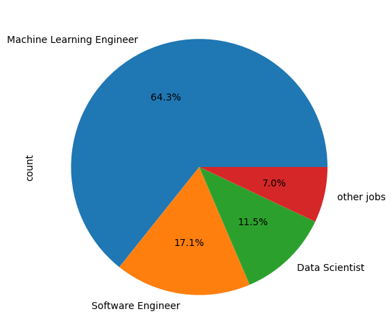
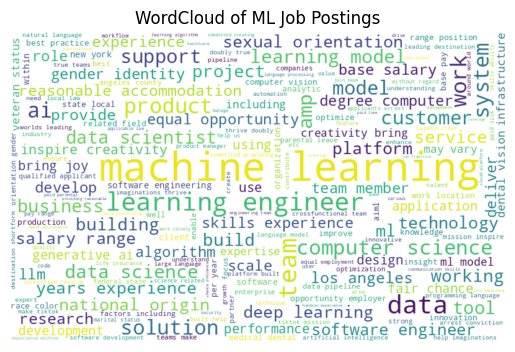
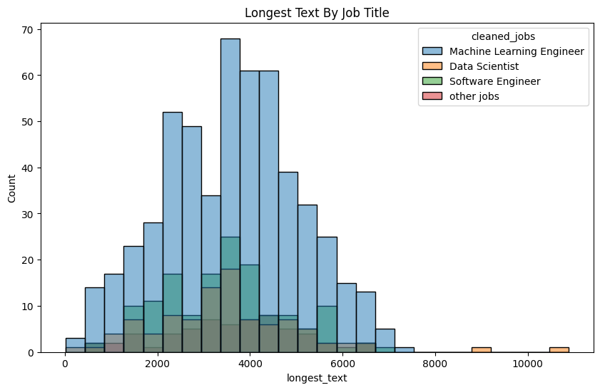
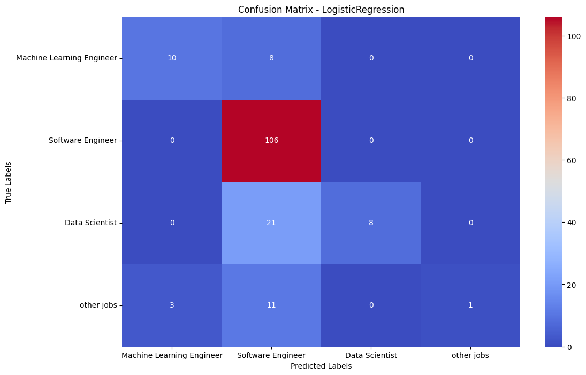
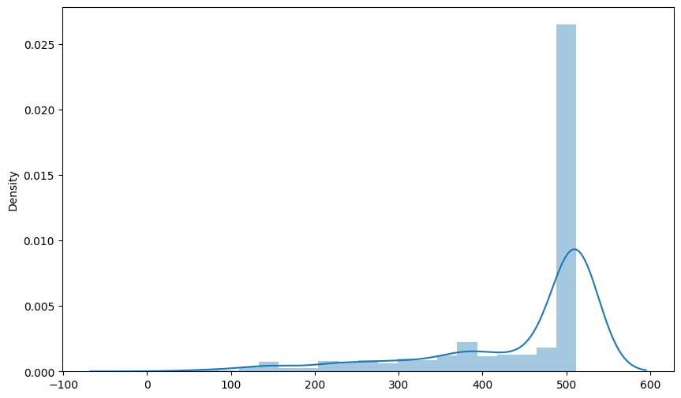

### Bert Data Jobs with T5 and other nlp teqniques
* Colab Link
[](https://colab.research.google.com/drive/1nw9vjsx-qESPT1oCcv7Yj5X-Ra7ssRH2)


This is from Kaggle, I usually do not share things from kaggle, but I like this so much. This brave, and hard-working individual, scrappred 1000 job postings relating to the following: Machine Learning Engineer, Data Science, Software Engineer, and 'other jobs'.


## Requirements
```bash
pip install -r requirements.txt
```


### The Job Titles are as follows
```text
job_title
Machine Learning Engineer                                                           243
Data Scientist                                                                       53
Software Engineer, Machine Learning                                                  30
Senior Machine Learning Engineer                                                     22
Software Engineer, Machine Learning (Multiple Levels) - Slack                         9
Machine Learning Engineer, AI (FULLY REMOTE, USA)                                     9
Machine Learning Engineer, AI Platform (FULLY REMOTE, USA ONLY)                       8
Machine Learning Engineer II                                                          8
Artificial Intelligence / Data Scientist Intern (HR)                                  8
Software Engineer                                                                     7
Machine Learning Engineer, Level 5                                                    7
Machine Learning Engineer, Level 4                                                    6
Machine Learning Engineer, Generative AI Innovation Center                            6
AI/ML Software Engineer                                                               5
Machine Learning Engineer with Generative AI                                          5
Machine Learning Engineer, AGIF | Finetuning                                          5
AI Software Engineer                                                                  5
Data Scientist - All Levels                                                           5
Software Engineer - Onboarding                                                        4
Machine Learning Engineer, Ads Targeting                                              4
Data Scientist, 1+ Years of Experience                                                4
Machine Learning Engineer - Summer Intern 2025                                        4
Machine Learning Engineer III                                                         4
Machine Learning Engineer - New Verticals                                             4
Machine Learning Engineer 2                                                           4
Software Engineer, Front End                                                          4
Machine Learning Engineer, Amazon General Intelligence (AGI)                          3
Software Engineer - Front End                                                         3
Machine Learning Engineer - Fine Tuning                                               3
Software Engineer - ML                                                                3
Machine Learning Engineer, Forecast Platform                                          3
Software Engineer - Machine Learning                                                  3
Machine Learning Engineer, AGIF                                                       3
Machine Learning Engineer, Gen AI Innovation Center, AWS                              3
AI/Machine Learning Engineer                                                          3
Machine Learning Engineer, Computer Vision                                            3
Machine Learning Engineer, Generative AI Innovation Center - Model Customization      3
Software Engineer - AI/ML, Multiple Locations                                         3
```
### User-Defined function to cut the fat
```python
def cleaning_job_titles(title):
    title = str(title)
    if "Machine Learning Engineer" in title:
        return "Machine Learning Engineer"
    elif "Data Scientist" in title:
        return "Data Scientist"
    elif "Software Engineer" in title:
        return "Software Engineer"
    else:
        return "other jobs"
```


### Pie Chart of the Proportion of Job Titles



### First, traditional NLP Strategies
```python
df['Text'] = df['company_description'] + " ." + df["job_description_text"] + " ." + df['job_title']


def clean_text(text):
    text = text.lower()
    text = re.sub(r"http\S+|www\S+|https\S+", '', text)
    text = contractions.fix(text)
    text = text.translate(str.maketrans('','',string.punctuation)) # removing punctuations
    text = re.sub(r'[^a-zA-Z0-9\s]','',text)
    text = re.sub(r'\d+','',text)
    STOPWORDS = set(stopwords.words("english"))
    tokens = word_tokenize(text)
    cleaned_tokens = [word for word in tokens if word.lower() not in STOPWORDS]

    text=  " ".join(cleaned_tokens)
    return text


df['clean_text'] = df['Text'].apply(clean_text)
df['job_description_text'] = df['job_description_text'].apply(clean_text)
df['clean_text'].head(10)
```

```text
0    upper hand leading provider fullsuite sports m...
1    built upon years mit research ikigai generativ...
2    adobe global leader digital media digital mark...
3    journey worlds trusted driver waymo driver imp...
4    adaptive learning company empowers educators f...
5    adobe global leader digital media digital mark...
6    walgreens included yous retail pharmacy segmen...
7    netflix one worlds leading entertainment servi...
8    netflix one worlds leading entertainment servi...
9    ailed platformdriven digital engineering enter...
Name: clean_text, dtype: object
```
#### WordCloud of the Most Frequent Words



#### Most Common Words by 'Data' job Postings

```text
[('data', 4497), ('learning', 4473), ('machine', 3755), ('experience', 3410), ('work', 2546), ('team', 2358), ('ai', 2167), ('models', 1973), ('ml', 1658), ('including', 1556), ('company', 1525), ('engineer', 1509), ('engineering', 1434), ('solutions', 1406), ('business', 1386), ('software', 1370), ('skills', 1294), ('systems', 1251), ('new', 1230), ('across', 1200), ('us', 1194), ('science', 1192), ('development', 1164), ('role', 1153), ('teams', 1128), ('help', 1120), ('model', 1098), ('product', 1077), ('employees', 1060), ('technology', 1059), ('range', 1044), ('benefits', 1027), ('may', 1017), ('platform', 1011), ('computer', 998), ('build', 995), ('opportunity', 991), ('building', 972), ('one', 972), ('people', 941), ('years', 938), ('working', 879), ('time', 876), ('information', 874), ('technical', 874), ('make', 866), ('mission', 844), ('design', 822), ('best', 810), ('employment', 787), ('tools', 783), ('position', 772), ('services', 766), ('status', 763), ('paid', 760), ('tiktok', 747), ('customers', 740), ('python', 738), ('related', 736), ('pay', 730), ('amp', 728), ('salary', 718), ('disability', 715), ('engineers', 699), ('please', 697), ('committed', 696), ('also', 695), ('every', 691), ('products', 680), ('vision', 675), ('support', 675), ('performance', 666), ('using', 658), ('develop', 657), ('compensation', 656), ('like', 653), ('impact', 652), ('join', 647), ('training', 643), ('technologies', 643), ('knowledge', 642), ('world', 638), ('candidates', 635), ('research', 634), ('global', 624), ('based', 623), ('create', 621), ('base', 620), ('deep', 619), ('job', 615), ('location', 608), ('degree', 606), ('eg', 602), ('cloud', 599), ('gender', 599), ('understanding', 585), ('leading', 584), ('algorithms', 572), ('industry', 571), ('opportunities', 568), ('looking', 567), ('learn', 562), ('pipelines', 561), ('ability', 557), ('large', 555), ('strong', 553), ('environment', 552), ('complex', 551), ('infrastructure', 547), ('developing', 528), ('improve', 527), ('drive', 513), ('diverse', 511), ('experiences', 507), ('bring', 504), ('together', 500), ('grow', 499), ('part', 488), ('need', 484), ('applicants', 481), ('problems', 480), ('equal', 480), ('search', 480), ('production', 479), ('language', 473), ('health', 471), ('customer', 470), ('provide', 467), ('applications', 465), ('use', 459), ('medical', 459), ('scalable', 458), ('expertise', 456), ('programming', 456), ('deliver', 456), ('future', 454), ('within', 453), ('qualifications', 453), ('protected', 449), ('frameworks', 448), ('apply', 447), ('process', 442), ('system', 441), ('scale', 436), ('processing', 435), ('techniques', 432), ('insurance', 431), ('national', 431), ('year', 430), ('life', 429), ('growth', 428), ('digital', 426), ('access', 421), ('andor', 418), ('applicable', 418), ('unique', 416), ('culture', 416), ('projects', 413), ('implement', 408), ('application', 406), ('core', 406), ('believe', 401), ('creating', 400), ('generative', 399), ('state', 399), ('analysis', 398), ('communication', 395), ('ensure', 395), ('relevant', 394), ('analytics', 394), ('field', 391), ('employer', 389), ('offer', 389), ('aws', 388), ('code', 386), ('sexual', 383), ('innovative', 382), ('day', 381), ('intelligence', 381), ('clients', 378), ('race', 378), ('members', 377), ('quality', 376), ('management', 374), ('equity', 374), ('value', 373), ('advanced', 373), ('innovation', 370), ('identity', 369), ('worlds', 369), ('video', 368), ('users', 367), ('career', 367), ('include', 367), ('local', 365), ('inclusive', 363), ('communities', 363), ('orientation', 360), ('hiring', 358), ('aiml', 356)]
```

#### Histogram of job title with the longest descriptions


#### First, traditional train/test split using sklearn's TfidVectorizer
```python


le = LabelEncoder()


X = df['clean_text']
y = df['cleaned_jobs']
y=  le.fit_transform(y)

X_train,X_test,y_train,y_test = train_test_split(X,y,test_size=.20,random_state=42)

tfid = TfidfVectorizer()

X_train_tfid = tfid.fit_transform(X_train).toarray()
X_test_tfid = tfid.transform(X_test).toarray()


models = {
"multinomialnaivebayes":MultinomialNB(),
"logisticregression":LogisticRegression(),
"gausianNB":GaussianNB(),
"bernoulinaivebates":BernoulliNB(),
"randomforestclf":RandomForestClassifier(),
"baggingclassifier":BaggingClassifier(),
}


for model_name,model in models.items():
    model.fit(X_train_tfid,y_train)
    pred = model.predict(X_test_tfid)
    clf_rpt = classification_report(y_test,pred)
    acc = accuracy_score(y_test, pred)
    f1 = f1_score(y_test,pred,average="weighted")
    print(f'{model.__class__.__name__}; --Accuracy-- {acc*100:.2f}%; --Classification Report-- {clf_rpt}')
    print(f'{model.__class__.__name__}; --f1 score: {f1*100:.2f}%')
```

### Confusion Matrix's from the traditional ML sklearn models


### Bert for Multi-Label Text-Classification
```python
df_bert = df.copy()

df_bert.head()
df_bert['Text'] = df_bert['cleaned_jobs'] + " ." + df_bert["job_description_text"] + " ." + df_bert['job_title']
df_bert['Text'] = df_bert['Text'].fillna("")
df_bert = df_bert[['Text','cleaned_jobs']]


df_bert.head(10)

df_bert['cleaned_jobs'].value_counts()

df_bert['Machine Learning Engineer'] = (df_bert['cleaned_jobs'] == "Machine Learning Engineer").astype(int)
df_bert['Software Engineer'] = (df_bert['cleaned_jobs'] == "Software Engineer").astype(int)
df_bert['Data Scientist'] = (df_bert['cleaned_jobs'] == "Data Scientist").astype(int)
df_bert['other jobs'] = (df_bert['cleaned_jobs'] == "other jobs").astype(int)
df_bert.drop("cleaned_jobs",axis=1,inplace=True)
df_bert.head(10)
```
* bert-base-base-uncased from Hugging Face and list to store the len of the sample tokens for a distriubtion pick the maximum sequence length to fine-tune bert.

```python
MODEL_NAME = "bert-base-uncased"
tokenizer = BertTokenizer.from_pretrained(MODEL_NAME)


sample_tokens = []
for txt in df_bert['Text']:
    tokens = tokenizer.encode(txt,max_length=512)
    sample_tokens.append(len(tokens))


plt.figure(figsize=(10,6))
sns.distplot(sample_tokens)
plt.show()
```



#### Custom Dataset Class
```python
MAX_LEN = 400


class Custom_Dataset(torch.utils.data.Dataset):
    def __init__(self,df_bert,labels,max_len,tokenizer):
        self.df_bert = df_bert
        self.Text = list(df_bert['Text'])
        self.targets = self.df_bert[labels].values
        self.max_len = max_len
        self.tokenizer=  tokenizer


    def __len__(self):
        return len(self.Text)


    def __getitem__(self, idx):
        Text = str(self.Text[idx])
        Text = " ".join(Text.split())

        encoder = self.tokenizer.encode_plus(
            Text,
            None,
            max_length=self.max_len,
            padding="max_length",
            truncation=True,
            return_attention_mask=True,
            return_token_type_ids=True,
            add_special_tokens=True,
            return_tensors='pt',
            )

        return {
            "Text":Text,
            "input_ids":encoder['input_ids'].flatten(),
            "attention_mask":encoder['attention_mask'].flatten(),
            "token_type_ids":encoder['token_type_ids'].flatten(),
            "targets":torch.FloatTensor(self.targets[idx])
            }


df_train,df_test = train_test_split(df_bert,test_size=.20,random_state=42)
df_val,df_test = train_test_split(df_test,test_size=.50,random_state=42)


labels = list(df_bert.columns)
labels = labels[1:]

train_dataset = Custom_Dataset(df_train,labels,max_len=MAX_LEN,tokenizer=tokenizer)
test_dataset = Custom_Dataset(df_test, labels, max_len=MAX_LEN, tokenizer=tokenizer)
val_dataset = Custom_Dataset(df_val, labels, max_len=MAX_LEN, tokenizer=tokenizer)

TRAIN_BATCH_SIZE = 8
TEST_BATCH_SIZE = 8
VAL_BATCH_SIZE = 8
learning_rate = 1e-5
epochs = 4


train_dataloader = torch.utils.data.DataLoader(train_dataset,batch_size=TRAIN_BATCH_SIZE,num_workers=4)
test_dataloader=  torch.utils.data.DataLoader(test_dataset,batch_size=TEST_BATCH_SIZE,num_workers=4)
val_dataloader = torch.utils.data.DataLoader(val_dataset,batch_size=VAL_BATCH_SIZE,num_workers=4)
```
### The NN for Bert
```python
class BertClassifier(nn.Module):
    def __init__(self):
        super(BertClassifier, self).__init__()
        self.bert_model = BertModel.from_pretrained(MODEL_NAME, return_dict=True)
        self.dropout = torch.nn.Dropout(0.1)
        self.linear = torch.nn.Linear(768, 4)

    def forward(self, input_ids, attention_mask, token_type_ids):
        output = self.bert_model(
            input_ids,
            attention_mask=attention_mask,
            token_type_ids=token_type_ids
        )
        output_dropout = self.dropout(output.pooler_output)
        output = self.linear(output_dropout)
        return output
```
* Side-Note, for Bert, when it comes to Multi-Label Classification, I have noticed, it always better when p=0.1, instead of p=0.3 . Four is the number of target's, that is, the job-title's.

### Training,Val, and testing accuracy and loss
```text
Training Accuracy: 99.85%; --Training Loss: 0.0753
val_acc: 100.00%; val_loss: 0.0445
testing accuracy: 100.00%
testing loss: 0.0481
```

### Seperate DataFrame for T5 fine-tuning
```python
df_t5 = df.copy()
df_t5 = df_t5[["job_description_text","company_description"]]
```
### Job Description is the selected feature to be the Sum Text
```python
df_t5['job_description_text'] = "Summarize: " + df_t5['job_description_text']
df_t5.head(10)
```

## Custom Dataset Class for T5
```python
class Custom_Dataset(torch.utils.data.Dataset):
    def __init__(self,dataframe,tokenizer,source_len,target_len,source_text,target_text):
        self.tokenizer = tokenizer
        self.data = dataframe
        self.source_len = source_len
        self.summ_len = target_len
        self.source_text = self.data[source_text]
        self.target_text = self.data[target_text]
        
        
    def __len__(self):
        return len(self.target_text)
    
    def __getitem__(self,index):
        target_text = str(self.target_text[index])
        source_text = str(self.source_text[index])
        

        
        source = self.tokenizer.batch_encode_plus([source_text], max_length= self.source_len, truncation=True, padding="max_length", return_tensors='pt')
        target = self.tokenizer.batch_encode_plus([target_text], max_length= self.summ_len, truncation=True, padding="max_length", return_tensors='pt')
        

        
        source_ids = source['input_ids'].squeeze()
        source_mask = source['attention_mask'].squeeze()
        target_ids = target['input_ids'].squeeze()
        target_ids = target['input_ids'].squeeze()
        
        return {
            "source_ids":source_ids.to(device,dtype=torch.long),
            "source_mask":source_mask.to(device,dtype=torch.long),
            "target_ids":target_ids.to(device,dtype=torch.long),
            "target_ids_y":target_ids.to(device,dtype=torch.long)
        }
```

### The Remaining will be in a notebook on collab for the generate text from T5 in .csv file or maybe .txt I do not know right now


